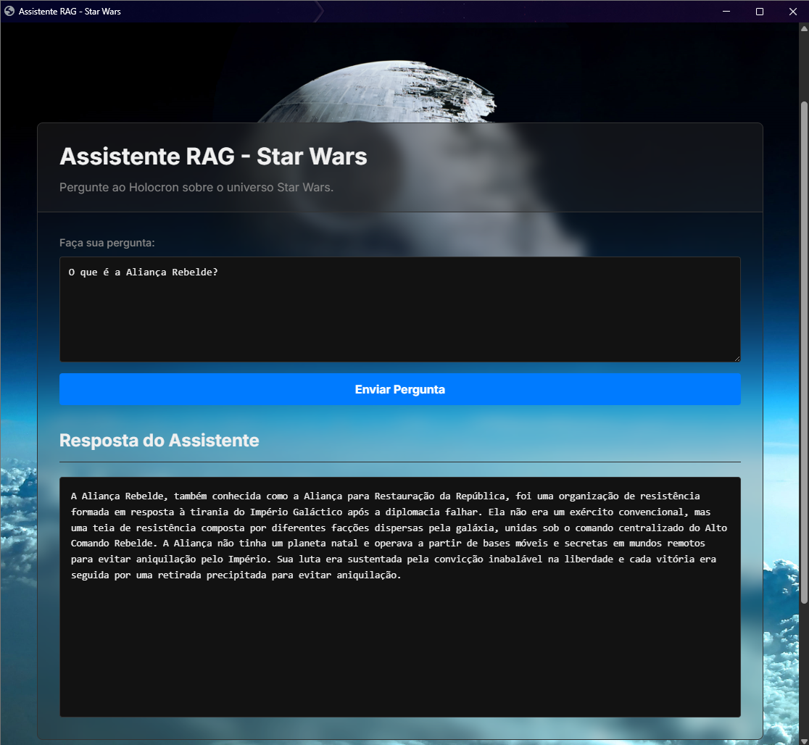

# Assistente RAG Temático - Star Wars

Este projeto implementa um assistente de chatbot baseado em Retrieval-Augmented Generation (RAG) focado no universo Star Wars. Ele utiliza uma coleção de textos sobre a saga para responder perguntas dos usuários em linguagem natural.

## Visão Geral

O sistema funciona da seguinte maneira:
1.  Uma coleção de 18 textos sobre Star Wars (incluída na pasta `data/`) é processada e transformada em embeddings vetoriais usando um modelo Sentence-Transformer.
2.  Esses vetores são armazenados junto com as fontes (índice pré-gerado incluído neste repositório na pasta `projects/`).
3.  Quando o usuário faz uma pergunta via interface web (criada com Eel):
	* A pergunta é transformada em um vetor.
	* Os textos mais relevantes são recuperados do índice por similaridade vetorial (top-k=2).
	* O LLM `mistral-nemo` (rodando localmente via Ollama e orquestrado por Langchain) recebe a pergunta e os textos recuperados como contexto.
	* O LLM gera a resposta final, que é exibida na interface web.

**Interface em Ação:**

**⚠️ Atenção:** O processamento da pergunta envolve carregar modelos e chamar o LLM localmente. A **resposta pode levar aproximadamente 1 minuto** para aparecer. Por favor, aguarde após clicar em "Enviar Pergunta".



## Tecnologias Utilizadas

* **Python 3.10+**
* **Ollama:** Para rodar o LLM `mistral-nemo` localmente.
* **Langchain:** Framework para orquestrar o pipeline RAG (`ChatOllama`, `retriever`, etc.).
* **Sentence Transformers:** Para gerar os embeddings (`paraphrase-multilingual-MiniLM-L12-v2`).
* **Eel:** Para criar a interface gráfica simples com HTML/CSS/JS.
* **Pandas, Numpy, Scikit-learn:** Para manipulação de dados e vetores.

## Configuração e Instalação

Siga estes passos para configurar o ambiente e rodar o projeto.

**1. Instale o Ollama:**

* **Windows:** Baixe e instale o Ollama a partir do site oficial: [https://ollama.com](https://ollama.com)
* **Linux/WSL:** Use o comando de instalação oficial no terminal:
	```bash
	curl -fsSL [https://ollama.ai/install.sh](https://ollama.ai/install.sh) | sh
	```
* Após a instalação, certifique-se de que o serviço Ollama esteja rodando (verifique o ícone na barra de tarefas do Windows ou use `ollama serve` no Linux/WSL se necessário).

**2. Clone o Repositório:**
```bash
git clone https://github.com/vini-mon/RAG-FAQ-Star_Wars
cd RAG-FAQ-Star_Wars 
```

**3. Instale as Dependências Python:**

* **Windows:** Execute o script `setup_windows.bat` clicando duas vezes nele ou rodando no Prompt de Comando/PowerShell[cite: 1]:
    ```bash
    .\setup_windows.bat
    ```
* **Linux/WSL:** Torne o script executável e rode-o:
    ```bash
    chmod +x setup_linux.sh
    ./setup_linux.sh
    ```


**4. Baixe o Modelo LLM: Após instalar o Ollama e as dependências Python, baixe o modelo mistral-nemo (isso pode levar algum tempo e requer ~7.1 GB de espaço):**

```bash

ollama pull mistral-nemo

```

Verifique se ele aparece na lista: ollama list.

Executando a Aplicação
Inicie o Backend: No terminal (Prompt de Comando, PowerShell ou terminal Linux/WSL com ambiente virtual ativo, se usado), na pasta raiz do projeto (RAG-FAQ-Star_Wars), execute:

```bash

python app.py

```

Você verá a mensagem Iniciando servidor Eel. *Se* o navegador não abrir automaticamente, acesse http://localhost:8000 no seu navegador.

## Use o Chatbot: Digite sua pergunta sobre Star Wars e clique em "Enviar Pergunta"!

Este repositório já inclui os vetores pré-gerados na pasta projects/pbl_3-star_wars/. Se você quiser modificá-los ou gerá-los a partir de outros dados:

Prepare seu arquivo de dados (ex: meus_dados.csv) na pasta data/ com uma coluna chamada text.

Você precisará adaptar e executar a lógica de indexação que originalmente estava no notebook LEARN.ipynb (células que chamam generate_faqs e embed_faqs). Isso pode exigir a criação de um script Python separado (como o run_index.py original, mas atualizado) ou rodar as células relevantes do notebook.

Certifique-se de que o config.yaml está apontando para os modelos corretos e que o Ollama (mistral-nemo) está rodando durante a geração das FAQs (se aplicável).

O resultado (novas pastas dentro de projects/) substituirá o índice existente.

## Tempo de Resposta

Este protótipo utiliza um modelo de linguagem grande (LLM) rodando localmente através do Ollama. O processamento de cada pergunta envolve a recuperação de contexto e a geração da resposta pelo LLM, o que pode consumir recursos significativos.

**Espere um tempo de resposta de aproximadamente 1 minuto** após enviar sua pergunta. A interface mostrará uma mensagem de "Consultando os holocrons..." durante este período.

**Estrutura do Projeto**

```
	.
	├── .gitignore 			# Arquivos a serem ignorados pelo Git
	├── app.py 				# Backend Eel que conecta frontend e RAG
	├── config.yaml 		# Configurações do RAG (modelos, caminhos)
	├── requirements.txt	# Dependências Python externas
	├── setup_linux.sh 		# Script de instalação para Linux/WSL
	├── setup_windows.bat 	# Script de instalação para Windows
	│
	├── LEARN.ipynb 			# Notebook com a execução dos dados usado no projeto
	├── RAG-FAQ_Star_Wars.pdf 	# Descrição mais "científica" do projeto
	│
	├── data/ 					
	│ └── PBL_3-data.csv		# Dados fonte
	│
	├── projects/ 			# Índices RAG gerados (vetores, faqs)
	│ ├── pbl_3-star_wars/
	│ ├── faq.csv
	│ └── embeddings.npy
	│
	├── rag_faq-0.1.0/ 		# Pasta raiz do pacote RAG local 
	│
	└── web/ 				# Arquivos do frontend (HTML, CSS, JS, Imagem)

```

(Nota: A pasta rag_faq-0.1.0/ descompactada não é estritamente necessária após a instalação via rag_faq.tar.gz, mas pode ser útil mantê-la no repositório para referência e desenvolvimento futuro).

**Links**
Repositório GitHub: https://github.com/vini-mon/RAG-FAQ-Star_Wars

Notebook Google Colab: 
https://colab.research.google.com/drive/1AScSjRKifsJ72MU5JLrsZemPfh312-tr?usp=sharing